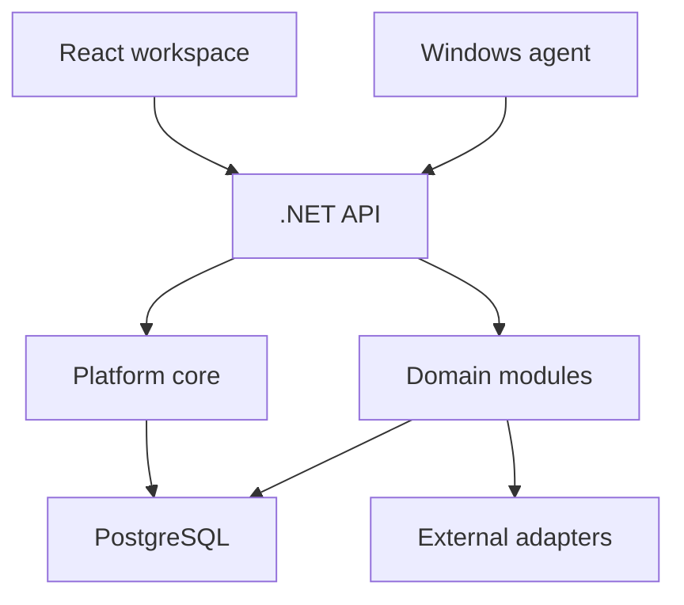

# Performance Lab · Engineering

**KNOTEN** is a modular B2B platform for bringing operational context from different parts of a company into one experience. This repository is a public engineering overview. Product source code, customer data, internal specifications, and deployment configuration live in a private repository.

> **Explore the product:** [Performance Lab](https://performancelab.dev/) · [Request a demonstration](https://performancelab.dev/). Access is currently guided; this repository does not offer a public demo account.

## The engineering problem

A useful signal in one department often needs context from another. A salesperson may need a client record and a next action; an operations manager may need to understand why a machine signal requires attention. The platform has to connect those views without giving every module ownership of every fact or exposing information outside the user's authority.

The design uses a **modular monolith**: domain boundaries and shared platform capabilities within one deployable backend. A tenant's module availability, a person's permissions, and their organizational scope are separate decisions. Cross-module views must respect all three.

This diagram describes components at a high level. The [architecture note](docs/ARCHITECTURE.md) distinguishes implemented foundations from directions still being consolidated.

## Technical decisions worth examining

| Decision | Engineering reason |
| --- | --- |
| Modular monolith | Keep one operational deployment while making domain ownership explicit. |
| Tenant and role-aware access | Module availability alone must not reveal another person's or department's data. |
| Domain-owned facts | Cross-module experiences consume authorized projections; they do not become extra writers of another domain's records. |
| Human confirmation for consequential actions | Assistance can prepare context and recommendations; authorized people decide and act. |
| Incremental integration | Existing routes and adapters are migrated toward explicit boundaries without assuming every path already uses the target contracts. |

## Technology in the product

The active application uses **.NET 8 / C#**, **React 18 / TypeScript / Vite**, **PostgreSQL 16 / EF Core**, and a **Windows agent** for telemetry. The repository also contains cloud deployment and operational tooling. Some modules are pilots or foundations; the presence of a module in the architecture is not a claim that it is production ready.

See the [module map](docs/MODULES.md) for responsibilities and technical organization, and the [engineering journal](docs/ENGINEERING_JOURNAL.md) for the decisions behind the work.

## Try KNOTEN

Visit [performancelab.dev](https://performancelab.dev/) to see the current presentation and request guided access. The public website marks features by their stage. A self-service public sandbox is not advertised here until a working, isolated demonstration is available.

## About this repository

These pages are an intentionally limited public projection of the private engineering record. They explain architecture, boundaries and development choices. They do not contain customer information, business rules, full API contracts, schema definitions, credentials or production runbooks. Public descriptions are reviewed independently of internal plans; a planned capability is never presented here as a shipped feature.
